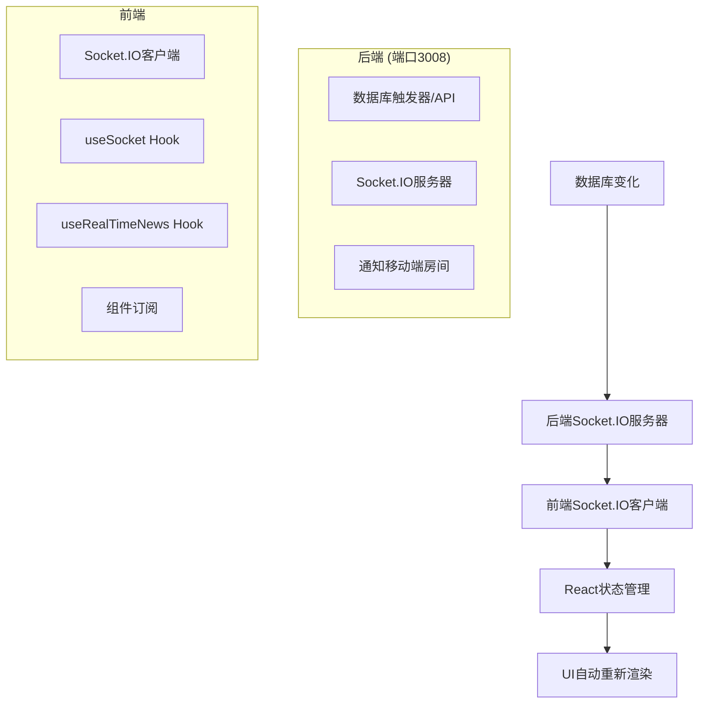

# Socket.IO 实时通信系统使用说明

## 概述

本项目实现了基于Socket.IO的实时通信系统，支持文章和评论的实时更新。当后端数据库发生变化时，前端页面会自动更新，无需手动刷新。

## 系统架构



## 核心组件

### 1. SocketClient (`src/utils/socketClient.ts`)

Socket.IO客户端的核心类，负责：
- 连接管理（自动重连、错误处理）
- 事件监听和发送
- 房间管理
- 连接状态监控

**主要方法：**
- `connect()`: 连接Socket服务器
- `disconnect()`: 断开连接
- `on(event, callback)`: 监听事件
- `off(event, callback)`: 移除事件监听
- `emit(event, data)`: 发送事件
- `joinRoom(room)`: 加入房间

### 2. useSocket Hook (`src/composables/useSocket.ts`)

React Hook，提供Socket连接的高级抽象：
- 自动连接管理
- 事件订阅管理
- 生命周期管理
- 错误处理

**主要功能：**
- `subscribeToNews(callback)`: 订阅新闻相关事件
- `subscribeToComments(callback)`: 订阅评论相关事件
- `subscribeToArticleUpdates(callback)`: 订阅文章更新事件

### 3. useRealTimeNews Hook (`src/composables/useRealTimeNews.ts`)

专门用于新闻实时更新的Hook：
- 自动管理新闻列表状态
- 实时添加/删除/更新新闻
- 智能排序（置顶 > 热点 > 普通）
- 自动刷新和错误处理

## 使用方法

### 基本用法

```tsx
import { useRealTimeNews } from '../composables/useRealTimeNews';
import { Channel } from '../types/news';

function MyComponent() {
  const {
    newsList,
    loading,
    error,
    refresh
  } = useRealTimeNews({
    channel: Channel.RECOMMEND,
    page: 1,
    limit: 20,
    autoRefresh: true
  });

  // 组件会自动接收实时更新
  return (
    <div>
      {newsList.map(news => (
        <div key={news._id}>{news.title}</div>
      ))}
    </div>
  );
}
```

### 手动控制Socket连接

```tsx
import { useSocket } from '../composables/useSocket';

function MyComponent() {
  const { connected, connect, disconnect } = useSocket({
    autoConnect: false,
    onConnect: () => console.log('连接成功'),
    onDisconnect: () => console.log('连接断开')
  });

  return (
    <div>
      <p>状态: {connected ? '已连接' : '未连接'}</p>
      <button onClick={connect}>连接</button>
      <button onClick={disconnect}>断开</button>
    </div>
  );
}
```

## 支持的事件

### 文章事件
- `article_created`: 新文章创建
- `article_deleted`: 文章删除
- `article_updated`: 文章更新

### 评论事件
- `comment_created`: 新评论创建
- `comment_deleted`: 评论删除

### 租户事件
- `tenant_created`: 新租户创建
- `tenant_updated`: 租户信息更新
- `tenant_deleted`: 租户删除

### 人员事件
- `person_created`: 新人员创建
- `person_deleted`: 人员删除

## 配置说明

### 后端配置
- 服务器端口: 3008
- CORS: 允许所有来源
- 房间: 支持移动端房间

### 前端配置
- 自动连接: 默认开启
- 自动重连: 默认开启
- 重连次数: 最多5次
- 重连延迟: 1秒

## 性能优化

1. **智能重新渲染**: 使用React.memo和useMemo避免不必要的重新渲染
2. **事件清理**: 组件卸载时自动清理事件监听器
3. **状态管理**: 使用useCallback优化函数引用
4. **连接池**: 复用Socket连接，避免重复连接

## 错误处理

- 连接失败自动重试
- 网络断开自动重连
- 事件监听器自动清理
- 用户友好的错误提示

## 调试工具

### SocketStatus组件
在主页面右上角显示Socket连接状态，支持手动连接/断开。

### 控制台日志
- 连接状态变化
- 事件接收和发送
- 错误信息

## 注意事项

1. **端口配置**: 确保后端Socket.IO服务器运行在3008端口
2. **CORS设置**: 后端需要允许前端域名的跨域请求
3. **事件命名**: 前后端事件名称必须一致
4. **房间管理**: 确保客户端正确加入相应的房间
5. **错误处理**: 始终处理连接失败和断开的情况

## 扩展功能

### 添加新的事件类型
1. 在后端Socket.IO服务器中添加新的事件处理
2. 在前端useSocket Hook中添加相应的事件订阅方法
3. 在组件中使用新的事件订阅

### 自定义房间管理
1. 修改SocketClient的joinRoom方法
2. 在useSocket Hook中添加房间管理逻辑
3. 根据业务需求动态加入/离开房间

## 故障排除

### 常见问题

1. **连接失败**
   - 检查后端服务器是否运行
   - 确认端口号是否正确
   - 检查网络连接和防火墙设置

2. **事件不触发**
   - 确认事件名称是否一致
   - 检查是否加入了正确的房间
   - 查看控制台是否有错误信息

3. **性能问题**
   - 检查事件监听器是否正确清理
   - 确认是否使用了React优化技巧
   - 监控内存使用情况

### 调试步骤

1. 检查浏览器控制台的Socket连接日志
2. 使用SocketStatus组件监控连接状态
3. 在后端添加详细的日志输出
4. 使用网络工具监控WebSocket连接

## 更新日志

- v1.0.0: 基础Socket.IO集成
- v1.1.0: 添加自动重连和错误处理
- v1.2.0: 实现新闻实时更新
- v1.3.0: 添加评论实时更新支持 