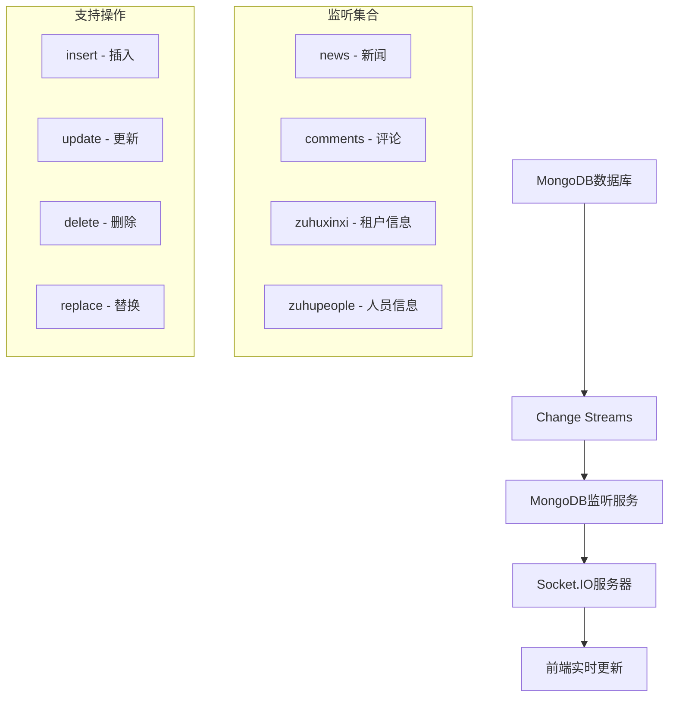

# MongoDB实时监听服务使用说明

## 🎯 功能概述

本服务实现了基于MongoDB Change Streams的实时数据库监听功能，能够监听数据库变化并实时通知前端。无论数据变化是通过应用代码还是手动操作数据库触发的，都能被捕获并通知前端。

## 🏗️ 系统架构



## 🚀 快速开始

### 1. 启动后端服务

```bash
cd Online-training/TrainServe
npm start
```

服务启动后，MongoDB监听服务会自动启动，延迟2秒以确保数据库连接稳定。

### 2. 检查服务状态

访问 `http://localhost:3008/mongo/status` 查看监听服务状态。

### 3. 测试实时功能

使用测试脚本验证功能：

```bash
node test-mongo-watcher.js
```

## 📡 监听功能

### 支持的集合

| 集合名称 | 事件前缀 | 说明 |
|---------|---------|------|
| `news` | `article` | 新闻文章 |
| `comments` | `comment` | 评论 |
| `zuhuxinxi` | `tenant` | 租户信息 |
| `zuhupeople` | `person` | 人员信息 |

### 支持的操作类型

- **insert**: 文档插入
- **update**: 文档更新
- **delete**: 文档删除
- **replace**: 文档替换
- **drop**: 集合删除
- **rename**: 集合重命名

## 🔌 API接口

### 获取服务状态

```http
GET /mongo/status
```

**响应示例：**
```json
{
  "success": true,
  "data": {
    "isWatching": true,
    "connected": true,
    "watchedCollections": ["news", "comments", "zuhuxinxi", "zuhupeople"],
    "reconnectAttempts": 0
  },
  "timestamp": "2024-01-15T10:30:00.000Z"
}
```

### 启动监听服务

```http
POST /mongo/start
```

### 停止监听服务

```http
POST /mongo/stop
```

### 重新连接

```http
POST /mongo/reconnect
```

## 🎯 前端集成

### 使用实时新闻Hook

```tsx
import { useRealTimeNews } from '../composables/useRealTimeNews';
import { Channel } from '../types/news';

function NewsList() {
  const {
    newsList,
    loading,
    error,
    refresh
  } = useRealTimeNews({
    channel: Channel.RECOMMEND,
    autoRefresh: true
  });

  // 列表会自动实时更新！
  return (
    <div>
      {newsList.map(news => (
        <div key={news._id}>{news.title}</div>
      ))}
    </div>
  );
}
```

### 手动订阅事件

```tsx
import { useSocket } from '../composables/useSocket';

function MyComponent() {
  const { subscribeToTenantUpdates } = useSocket();

  useEffect(() => {
    const unsubscribe = subscribeToTenantUpdates((data) => {
      switch (data.action) {
        case 'created':
          console.log('新租户创建:', data.id);
          break;
        case 'updated':
          console.log('租户信息更新:', data.id);
          break;
        case 'deleted':
          console.log('租户删除:', data.id);
          break;
      }
    });

    return unsubscribe;
  }, [subscribeToTenantUpdates]);
}
```

## 🔧 配置说明

### 环境变量

```bash
# MongoDB连接字符串
MONGODB_URI=mongodb://localhost:27017/online_training
```

### 连接参数

```javascript
const connectionOptions = {
  useNewUrlParser: true,
  useUnifiedTopology: true,
  serverSelectionTimeoutMS: 5000,
  socketTimeoutMS: 45000,
};
```

### 重连配置

```javascript
const reconnectConfig = {
  maxReconnectAttempts: 5,    // 最大重连次数
  reconnectDelay: 5000,       // 重连延迟(毫秒)
};
```

## 📊 监控和调试

### 控制台日志

服务运行时会输出详细的日志信息：

```
✅ MongoDB连接成功: online_training
🚀 开始监听MongoDB变化...
✅ 开始监听集合: news
✅ 开始监听集合: comments
✅ 开始监听集合: zuhuxinxi
✅ 开始监听集合: zuhupeople
✅ 所有集合监听已启动
📡 检测到变化: insert in news
📤 发送Socket事件: article_created
```

### 状态监控

通过API接口实时监控服务状态：

```bash
# 查看服务状态
curl http://localhost:3008/mongo/status

# 手动重启服务
curl -X POST http://localhost:3008/mongo/reconnect
```

## 🚨 错误处理

### 常见错误及解决方案

#### 1. 连接失败

**错误信息：**
```
❌ MongoDB连接失败: ECONNREFUSED
```

**解决方案：**
- 检查MongoDB服务是否运行
- 确认连接字符串和端口
- 检查防火墙设置

#### 2. 权限不足

**错误信息：**
```
❌ 创建Change Stream失败: Access denied
```

**解决方案：**
- 确保MongoDB用户有读取权限
- 检查数据库访问权限
- 使用管理员账户测试

#### 3. 集合不存在

**错误信息：**
```
⚠️ 集合 news 不存在，跳过监听
```

**解决方案：**
- 创建相应的集合
- 检查集合名称拼写
- 确保数据库中有数据

### 自动重连机制

服务具备自动重连功能：

1. **网络断开**: 自动尝试重连
2. **Change Stream关闭**: 自动重新创建
3. **连接错误**: 指数退避重连
4. **重连限制**: 最多5次重连尝试

## 🧪 测试指南

### 手动测试

1. **启动服务**: 确保后端和MongoDB运行
2. **插入数据**: 在MongoDB中插入测试文档
3. **观察日志**: 检查控制台输出
4. **前端验证**: 确认前端收到实时更新

### 自动化测试

使用提供的测试脚本：

```bash
# 运行完整测试
node test-mongo-watcher.js

# 测试特定功能
node -e "require('./test-mongo-watcher').testMongoWatcher()"
```

### 性能测试

```bash
# 批量插入测试
for i in {1..100}; do
  mongo online_training --eval "
    db.news.insertOne({
      title: '测试文章 $i',
      content: '内容 $i',
      channel: '推荐',
      publishTime: new Date()
    })
  "
  sleep 0.1
done
```

## 🔒 安全考虑

### 权限控制

- 使用最小权限原则
- 限制数据库访问范围
- 定期审查访问权限

### 数据验证

- 验证输入数据格式
- 过滤敏感信息
- 记录操作日志

### 网络安全

- 使用TLS加密连接
- 限制网络访问
- 监控异常连接

## 📈 性能优化

### 连接池管理

- 复用数据库连接
- 合理设置连接数
- 监控连接状态

### 事件处理

- 异步处理事件
- 批量处理更新
- 避免阻塞操作

### 内存管理

- 及时清理事件监听器
- 监控内存使用
- 定期垃圾回收

## 🚀 扩展功能

### 添加新集合监听

1. 在`mongoWatcher.js`中添加新集合
2. 定义事件前缀映射
3. 添加事件处理逻辑
4. 更新前端Hook

### 自定义事件处理

```javascript
// 在notifyEvent方法中添加新事件类型
case 'custom_event':
  socketManager.notifyCustomEvent(data);
  break;
```

### 数据过滤

```javascript
// 添加数据过滤逻辑
if (data.sensitive) {
  console.log('跳过敏感数据');
  return;
}
```

## 📝 更新日志

- **v1.0.0**: 基础Change Streams监听
- **v1.1.0**: 添加自动重连机制
- **v1.2.0**: 支持更多集合和操作类型
- **v1.3.0**: 添加状态监控API
- **v1.4.0**: 完善错误处理和日志

## 🤝 贡献指南

1. Fork项目
2. 创建功能分支
3. 提交更改
4. 创建Pull Request

## 📞 技术支持

如遇问题，请：

1. 查看控制台日志
2. 检查API状态接口
3. 运行测试脚本
4. 提交Issue描述问题

---

**注意**: 本服务需要MongoDB 3.6+版本支持，确保数据库版本兼容性。 